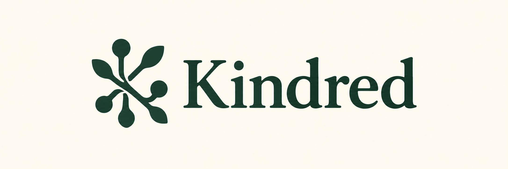

<p align="center">
  
</p>

<p align="center"><strong>Your family's stories, connected.</strong></p>

<p align="center">
  <a href="docs/VISION.md">The vision</a> ·
  <a href="docs/ROADMAP.md">What's next</a> ·
  <a href="https://github.com/niklas-heer/kindred/issues">Ideas & feedback</a>
</p>

# A family archive you can explore

**Keep your family's stories in readable files, then follow the connections.**
Kindred is a local Rust CLI and browser graph for a Markdown family-history
archive. It needs no account, server subscription, or Obsidian installation.

Read biographies beside relationships and evidence. Explore ancestors,
descendants, family neighborhoods, or a path between two people. Keep biological,
adoptive, foster, and partner claims distinct, with tentative and disputed claims
visible only when you choose them. Original date wording stays intact.

## Try it

Install with Homebrew:

```sh
brew install niklas-heer/tap/kindred
kindred init ./my-family
kindred serve ./my-family
```

Or download a binary for macOS, Linux, or Windows from
[GitHub Releases](https://github.com/niklas-heer/kindred/releases).
To build from source and explore the bundled examples, install the
[development prerequisites](CONTRIBUTING.md), then:

```sh
mise trust
mise install
mise run build
./target/release/kindred check examples/fictional
./target/release/kindred serve examples/fictional
```

Open the localhost URL printed by the command. Search for a person, select an
ancestor view, expand a branch, and inspect a relationship's evidence. You can
edit the complete Markdown note in the details panel or with an ordinary editor.
Kindred checks for external changes before saving.

For a deeper example, explore the **Carolingian, Plantagenet, Tudor, Stuart, and Hanover families**, with
88 deceased people spanning roughly the sixth through eighteenth centuries:

```sh
./target/release/kindred serve examples/historical/european-dynasties
./target/release/kindred ancestors examples/historical/european-dynasties \
  p_edward_iv --generations 4 --relations biological_parent --json
```

The [historical examples guide](docs/HISTORICAL_EXAMPLES.md) explains the sources,
selected branches, shared ancestors, and uncertainty. These are transparent
software examples, not a complete or definitive royal genealogy.

## Your files remain the archive

Write one Markdown note per person, with [YAML metadata](docs/SCHEMA.md) for
parents, partners, dates, places, citations, occupations, and a local portrait.
Kindred discovers the graph from those fields. Keep stories in the same note
and files in an attachments folder. Organize person notes however you like;
folder names do not determine their meaning. Existing separate typed notes
remain readable. Prose links never silently become parentage
claims. Validation catches duplicate IDs, broken links, ambiguous filenames,
malformed metadata, and missing evidence files.

The index is disposable. Every command reads the authoritative files; rebuilding
or deleting `.kindred/index.json` cannot erase research. Queries return record
and claim IDs with source references, as a terminal list or JSON.

```sh
kindred init ./my-family
kindred check ./my-family --json
kindred reindex ./my-family
kindred export ./my-family ../complete-backup --all
kindred export ./my-family ../public-metadata --public
```

Complete exports include attachments and interpretation metadata. Public exports
include only a narrow metadata projection of explicitly deceased, non-private
people. GEDCOM import/export is a documented subset with explicit loss reports;
use a complete archive export for backups.

See the [user guide](docs/USER_GUIDE.md) for editing, recovery, export policy,
GEDCOM mappings, keyboard controls, and the limits of local concurrency.

## Status and development

The core single-user workflow is implemented: validate, query, explore, edit,
recover, rebuild, and exchange an archive. It is early software with bounded
verification, not a claim of production maturity or exhaustive genealogy-format
support. Desktop packaging, maps/timelines, hosted collaboration, online tree
merging, DNA analysis, and AI-generated facts are outside this implementation.

The [vision](docs/VISION.md) describes the product principles. The
[roadmap](docs/ROADMAP.md) records implemented outcomes and verification scope;
[decisions](docs/DECISIONS.md) explain the architecture. Run `mise run check` for
the native quality gate or `mise run ci` for the containerized Linux checks.
See the [changelog](CHANGELOG.md) for release notes generated from Conventional Commits.

For contributions, start with [CONTRIBUTING.md](CONTRIBUTING.md). Use fictional
records for failure cases and personal scenarios; sourced historical examples
must contain only deceased people. Never put private family data in an issue.

## License

Kindred is open source under the [MIT license](LICENSE). Your family records
remain yours. Historical source pages retain their own licenses; examples use
brief original prose and linked citations.
